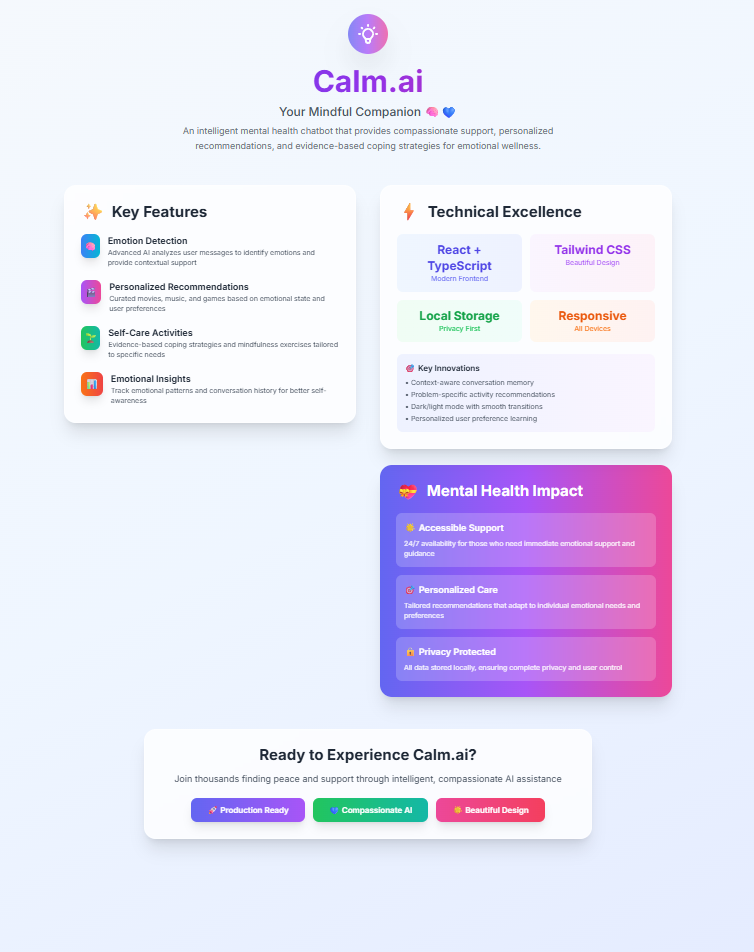

# 🧠 Calm.ai – Your Mindful Companion

**Calm.ai** is an intelligent mental health chatbot designed to provide emotional support, personalized wellness recommendations, and compassionate guidance through AI-driven conversations.

Built during the **Hack2Build 2025 Hackathon**, this project utilizes **Bolt AI** to create a fully local-first, privacy-conscious mental wellness assistant that adapts to the user’s emotional state.

---

## ✨ Features

- 🧠 **Emotion Detection**  
  Detects emotional tone from user input and responds empathetically using Bolt AI agent logic.

- 🎵 **Personalized Recommendations**  
  Suggests music, games, and entertainment content based on user mood and preferences.

- 🌱 **Self-Care Activities**  
  Offers science-backed mindfulness and mental health exercises for recovery and reflection.

- 📊 **Emotional Insights**  
  Tracks emotional trends over time (locally) to improve self-awareness and care habits.

http://calm-ai-your-mindful-companion-thomaspaulcj.vercel.app
---

## ⚙️ Tech Stack

| Layer         | Technology             |
|---------------|------------------------|
| AI Backend    | Bolt AI (agent builder) |
| Frontend      | React + TypeScript     |
| Styling       | Tailwind CSS           |
| Hosting Dev   | Ngrok (local tunneling) |
| Storage       | LocalStorage (privacy-first)

---

## 🛠️ Setup

> ⚠️ **Note:** The `.bolt/` folder is excluded from the repo for security reasons. You'll need your own Bolt AI agent setup to run the full pipeline.

### 1. Clone the repo

```bash
git clone https://github.com/YourUsername/calm-ai.git
cd calm-ai
```
### 2. Install dependencies
```bash
npm install
```
### 3. Run the app
```bash
npm run dev
```
### 4. Create a tunnel with ngrok (Optional)
```bash
ngrok http 5173
```
## 📸 Preview
<p align="center">
 
</p>

## 🧠 Innovations
Context-aware emotional routing via Bolt pipelines

Dark/light mode transitions for accessibility

Adaptive self-care flow with learning preferences

Clean, mobile-friendly design with animation

## 💝 Mental Health Impact
24/7 support without requiring human moderation

Local-first architecture to protect user privacy

Smart suggestions based on emotional trajectory

## 📄 License
This project is shared for educational/demo purposes only.
All AI logic and configuration remains property of the author.
© 2025 Thomas Paul CJ. All rights reserved.

---

## 🙌 Credits & Acknowledgements

This project was built during the **GenAI Hackathon 2025**, hosted by the **[Boston Institute of Analytics (BIA)](https://www.bostoninstituteofanalytics.org/)**.

> 🧵 Read the full story behind Calm.ai on LinkedIn:  
> [🔗 LinkedIn Post by Thomas Paul CJ](https://www.linkedin.com/posts/thomaspaulcj_genai-hackathon-mentalhealthtech-activity-7341720287207456769-SChi?utm_source=share&utm_medium=member_desktop)

Special thanks to:
- [Bolt AI](https://boltai.tech) for enabling fast agent development
- The BIA Hackathon organizing team
- Everyone who contributed ideas, feedback, and support during the event

---

## 👥 Team

This project was built by Team **Calm.ai** during the GenAI Hackathon 2025 hosted by Boston Institute of Analytics.

**Team Members:**
- [Thomas Paul CJ](https://github.com/ThomasPaulCJ)
- [Vidhusankar CH](https://github.com/vidhusankar-hozo)
- Manu Mathew
- Nayif Nazar
